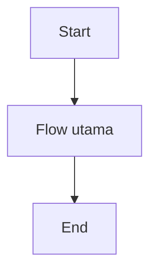
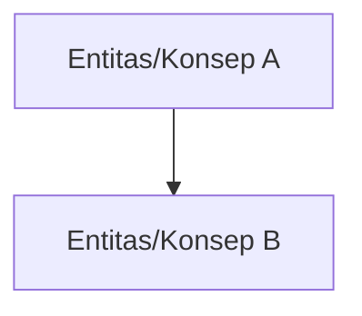

# PRD - [Nama Epic]

## Business Process Diagram

## Problem Statement Epic

Problem utama epic Penjualan adalah UMKM membutuhkan cara yang sederhana untuk mengelola penjualan tunai maupun tagihan, tetapi proses bisnis penjualan sering melibatkan banyak kondisi: transaksi bisa langsung lunas, belum dibayar, dibayar sebagian, dibayar lewat termin sederhana, atau melewati jatuh tempo. Jika proses dari pembuatan invoice, pencatatan pembayaran, pemantauan piutang, sampai pembentukan jurnal akuntansi tidak terhubung dengan baik, user akan kesulitan mengetahui status transaksi secara akurat. Dampaknya, cashflow bisa terganggu karena piutang tidak tertagih tepat waktu, dan laporan keuangan bisa tidak akurat karena pendapatan, piutang, kas/bank, dan pajak tidak tercatat secara konsisten.

## Goal Epic

Epic Penjualan bertujuan membantu UMKM mengelola siklus penjualan secara sederhana, terstruktur, dan akurat secara akuntansi, mulai dari pencatatan transaksi penjualan, penerbitan invoice, pencatatan pembayaran, hingga pemantauan piutang usaha. Dengan adanya epic ini, user diharapkan dapat mengetahui status setiap transaksi penjualan secara jelas, menjaga piutang tetap terpantau, serta memastikan pencatatan pendapatan, piutang, kas/bank, dan pajak terbentuk secara konsisten tanpa harus memahami proses jurnal secara manual.

| No | Tujuan                                                            | Penjelasan                                                                                                                                                                              |
| -: | ----------------------------------------------------------------- | --------------------------------------------------------------------------------------------------------------------------------------------------------------------------------------- |
|  1 | Memudahkan user mencatat transaksi penjualan tunai maupun tagihan | User dapat mencatat penjualan barang/jasa non-inventory dengan alur yang mudah dipahami oleh UMKM kecil                                                                                 |
|  2 | Membuat status transaksi penjualan lebih jelas dan terkontrol     | Setiap transaksi dapat diketahui statusnya, seperti draft, final, belum dibayar, dibayar sebagian, lunas, jatuh tempo, atau dibatalkan                                                  |
|  3 | Membantu user memantau piutang usaha                              | Invoice yang belum lunas dapat dipantau berdasarkan customer, sisa tagihan, dan jatuh tempo                                                                                             |
|  4 | Menghubungkan pembayaran customer dengan invoice yang benar       | Pembayaran penuh maupun sebagian dapat mengurangi tagihan dan memperbarui status invoice secara konsisten                                                                               |
|  5 | Menjaga pencatatan akuntansi penjualan tetap akurat               | Sistem membantu membentuk pencatatan pendapatan, piutang, kas/bank, dan pajak berdasarkan aturan transaksi yang benar                                                                   |
|  6 | Mengurangi risiko kesalahan koreksi transaksi final               | Invoice yang sudah final tidak diubah bebas, melainkan dikoreksi melalui pembatalan atau reversal agar audit trail tetap terjaga                                                        |
|  7 | Menyediakan fondasi MVP yang sederhana namun scalable             | MVP fokus pada kebutuhan UMKM kecil, tetapi tetap membuka ruang pengembangan ke kebutuhan lebih kompleks seperti inventory, termin lanjutan, reminder otomatis, dan enterprise workflow |

## Indikator Kebehasilan Epic

| Kategori                 | Nama Indikator                              | Deskripsi                                                                                                                   | Cara Pengukuran                                                                                                                | Waktu Pengukuran                                                                         | Target                                                                                                                     | Penanggung Jawab     |
| ------------------------ | ------------------------------------------- | --------------------------------------------------------------------------------------------------------------------------- | ------------------------------------------------------------------------------------------------------------------------------ | ---------------------------------------------------------------------------------------- | -------------------------------------------------------------------------------------------------------------------------- | -------------------- |
| Kemudahan Operasional    | Kemudahan pembuatan transaksi penjualan     | Mengukur apakah user dapat memahami dan menyelesaikan proses pembuatan transaksi penjualan/invoice                          | Review flow UIUX, UAT skenario pembuatan transaksi, dan observasi apakah user dapat menyelesaikan flow tanpa kebingungan besar | Sebelum rilis: Design Review, QA, UAT. Setelah rilis: evaluasi penggunaan awal           | User dapat membuat transaksi penjualan sampai final melalui alur yang jelas dan minim hambatan                             | PO, UIUX, QA         |
| Kontrol Status Transaksi | Kejelasan status invoice                    | Mengukur apakah setiap invoice memiliki status yang jelas dan mudah dipahami                                                | Validasi status pada skenario draft, final, belum dibayar, dibayar sebagian, lunas, overdue, dan dibatalkan                    | Sebelum rilis: QA dan UAT. Setelah rilis: monitoring data transaksi                      | Semua kondisi utama invoice memiliki status yang valid, konsisten, dan tampil jelas di UI                                  | PO, UIUX, FE, BE, QA |
| Kontrol Piutang          | Keterpantauan invoice belum lunas           | Mengukur apakah invoice yang belum lunas dapat dipantau sebagai piutang berdasarkan customer, sisa tagihan, dan jatuh tempo | QA skenario invoice belum dibayar, dibayar sebagian, overdue, dan validasi tampilan daftar piutang                             | Sebelum rilis: QA dan UAT. Setelah rilis: monitoring penggunaan daftar piutang           | Semua invoice belum lunas muncul sebagai piutang dengan informasi utama yang lengkap                                       | PO, UIUX, FE, BE, QA |
| Akurasi Pembayaran       | Kesesuaian pembayaran dengan invoice        | Mengukur apakah pembayaran customer tercatat pada invoice yang benar dan memperbarui status serta sisa tagihan              | QA skenario pembayaran penuh, sebagian, bertahap, dan pembayaran setelah jatuh tempo                                           | Sebelum rilis: QA dan UAT. Setelah rilis: monitoring kasus pembayaran tidak cocok        | Pembayaran selalu terhubung ke invoice yang benar dan memperbarui outstanding amount serta status invoice secara konsisten | PO, BE, QA           |
| Akurasi Akuntansi        | Konsistensi jurnal penjualan dan pembayaran | Mengukur apakah invoice final dan pembayaran menghasilkan pencatatan akuntansi yang sesuai aturan                           | Validasi hasil jurnal pada skenario invoice final, pembayaran penuh, pembayaran sebagian, pajak, dan pembatalan/reversal       | Sebelum rilis: QA, UAT, dan review rule akuntansi. Setelah rilis: audit sample transaksi | Jurnal terbentuk konsisten sesuai aturan transaksi yang disepakati                                                         | PO, BE, QA           |
| Cashflow Control         | Kemudahan tindak lanjut piutang jatuh tempo | Mengukur apakah user dapat mengenali invoice yang perlu ditindaklanjuti                                                     | Validasi overdue status, filter/sort daftar piutang, dan penanda internal jika tersedia                                        | Sebelum rilis: QA dan UAT. Setelah rilis: evaluasi penggunaan daftar overdue             | User dapat menemukan invoice overdue dan mengetahui tagihan mana yang perlu ditindaklanjuti                                | PO, UIUX, FE, QA     |

## Peta Flow Awal

## Role Access Matrix

| Fitur        | Role 1 | Role 2 | Role 3 | Role 4 |
| ------------ | ------ | ------ | ------ | ------ |
| [Nama Fitur] | ✓      | ✓      | -      | -      |

## Scope

### In

* [Scope in]

### Planned

* [Planned scope / planned features]

### Out of Scope

* [Out of scope]

## Aturan Bisnis Epic

* [Aturan bisnis epic 1]
* [Aturan bisnis epic 2]

## Diagram Konsep

## Supporting Information

[Supporting information epic]

