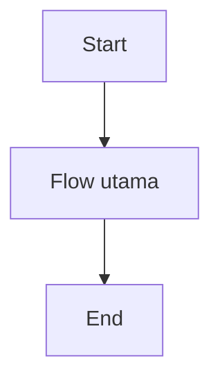
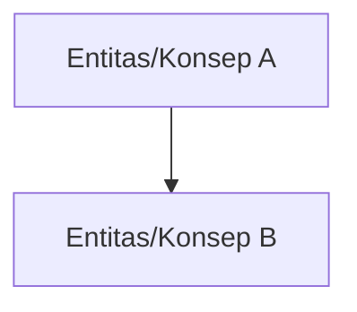

# PRD - [Nama Epic]

## Business Process Diagram

## Problem Statement Epic

Problem utama epic Penjualan adalah UMKM membutuhkan cara yang sederhana untuk mengelola penjualan tunai maupun tagihan, tetapi proses bisnis penjualan sering melibatkan banyak kondisi: transaksi bisa langsung lunas, belum dibayar, dibayar sebagian, dibayar lewat termin sederhana, atau melewati jatuh tempo. Jika proses dari pembuatan invoice, pencatatan pembayaran, pemantauan piutang, sampai pembentukan jurnal akuntansi tidak terhubung dengan baik, user akan kesulitan mengetahui status transaksi secara akurat. Dampaknya, cashflow bisa terganggu karena piutang tidak tertagih tepat waktu, dan laporan keuangan bisa tidak akurat karena pendapatan, piutang, kas/bank, dan pajak tidak tercatat secara konsisten.

## Goal Epic

[Isi goal epic]

## Indikator Kebehasilan Epic

| Kategori | Nama Indikator | Deskripsi | Cara Pengukuran | Waktu Pengukuran | Target | Penanggung Jawab |
| -------- | -------------- | --------- | --------------- | ---------------- | ------ | ---------------- |
|          |                |           |                 |                  |        |                  |

## Peta Flow Awal

## Role Access Matrix

| Fitur        | Role 1 | Role 2 | Role 3 | Role 4 |
| ------------ | ------ | ------ | ------ | ------ |
| [Nama Fitur] | ✓      | ✓      | -      | -      |

## Scope

### In

* [Scope in]

### Planned

* [Planned scope / planned features]

### Out of Scope

* [Out of scope]

## Aturan Bisnis Epic

* [Aturan bisnis epic 1]
* [Aturan bisnis epic 2]

## Diagram Konsep

## Supporting Information

[Supporting information epic]

