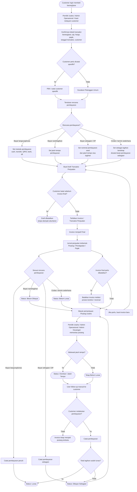
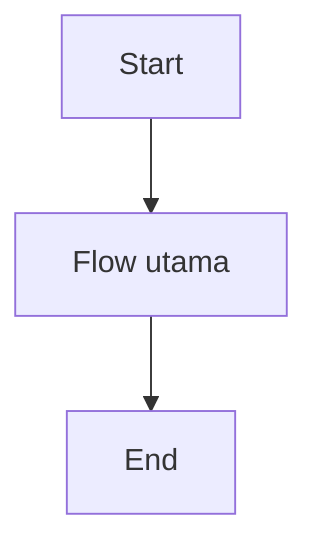
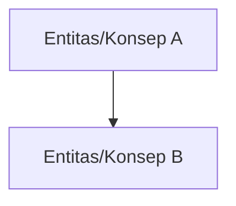

# PRD - [Nama Epic]

## Business Process Diagram

## Problem Statement Epic

Problem utama epic Penjualan adalah UMKM membutuhkan cara yang sederhana untuk mengelola penjualan tunai maupun tagihan, tetapi proses bisnis penjualan sering melibatkan banyak kondisi: transaksi bisa langsung lunas, belum dibayar, dibayar sebagian, dibayar lewat termin sederhana, atau melewati jatuh tempo. Jika proses dari pembuatan invoice, pencatatan pembayaran, pemantauan piutang, sampai pembentukan jurnal akuntansi tidak terhubung dengan baik, user akan kesulitan mengetahui status transaksi secara akurat. Dampaknya, cashflow bisa terganggu karena piutang tidak tertagih tepat waktu, dan laporan keuangan bisa tidak akurat karena pendapatan, piutang, kas/bank, dan pajak tidak tercatat secara konsisten.

## Goal Epic

Epic Penjualan bertujuan membantu UMKM mengelola siklus penjualan secara sederhana, terstruktur, dan akurat secara akuntansi, mulai dari pencatatan transaksi penjualan, penerbitan invoice, pencatatan pembayaran, hingga pemantauan piutang usaha. Dengan adanya epic ini, user diharapkan dapat mengetahui status setiap transaksi penjualan secara jelas, menjaga piutang tetap terpantau, serta memastikan pencatatan pendapatan, piutang, kas/bank, dan pajak terbentuk secara konsisten tanpa harus memahami proses jurnal secara manual.

| No | Tujuan                                                            | Penjelasan                                                                                                                                                                              |
| -: | ----------------------------------------------------------------- | --------------------------------------------------------------------------------------------------------------------------------------------------------------------------------------- |
|  1 | Memudahkan user mencatat transaksi penjualan tunai maupun tagihan | User dapat mencatat penjualan barang/jasa non-inventory dengan alur yang mudah dipahami oleh UMKM kecil                                                                                 |
|  2 | Membuat status transaksi penjualan lebih jelas dan terkontrol     | Setiap transaksi dapat diketahui statusnya, seperti draft, final, belum dibayar, dibayar sebagian, lunas, jatuh tempo, atau dibatalkan                                                  |
|  3 | Membantu user memantau piutang usaha                              | Invoice yang belum lunas dapat dipantau berdasarkan customer, sisa tagihan, dan jatuh tempo                                                                                             |
|  4 | Menghubungkan pembayaran customer dengan invoice yang benar       | Pembayaran penuh maupun sebagian dapat mengurangi tagihan dan memperbarui status invoice secara konsisten                                                                               |
|  5 | Menjaga pencatatan akuntansi penjualan tetap akurat               | Sistem membantu membentuk pencatatan pendapatan, piutang, kas/bank, dan pajak berdasarkan aturan transaksi yang benar                                                                   |
|  6 | Mengurangi risiko kesalahan koreksi transaksi final               | Invoice yang sudah final tidak diubah bebas, melainkan dikoreksi melalui pembatalan atau reversal agar audit trail tetap terjaga                                                        |
|  7 | Menyediakan fondasi MVP yang sederhana namun scalable             | MVP fokus pada kebutuhan UMKM kecil, tetapi tetap membuka ruang pengembangan ke kebutuhan lebih kompleks seperti inventory, termin lanjutan, reminder otomatis, dan enterprise workflow |

## Indikator Kebehasilan Epic

| Kategori                           | Target                                                                                                                                               | Deskripsi                                                                                                                                                                                                                                 | Cara Pengukuran                                                                                                                                                                                                                                                                                                                         | Waktu Pengukuran                        | Penanggung Jawab |
| ---------------------------------- | ---------------------------------------------------------------------------------------------------------------------------------------------------- | ----------------------------------------------------------------------------------------------------------------------------------------------------------------------------------------------------------------------------------------- | --------------------------------------------------------------------------------------------------------------------------------------------------------------------------------------------------------------------------------------------------------------------------------------------------------------------------------------- | --------------------------------------- | ---------------- |
| Keberhasilan Alur Penggunaan       | Minimal 95% skenario valid berhasil dibuat, disimpan sebagai draft, dan diterbitkan menjadi invoice final.                                           | Mengukur apakah user dapat membuat transaksi penjualan barang/jasa non-inventory dengan alur yang jelas, mulai dari memilih customer, mengisi item, qty, harga, pajak, tanggal transaksi, rencana pembayaran, hingga menerbitkan invoice. | QA menjalankan minimal 30 skenario valid end-to-end, mencakup transaksi tunai, transaksi tagihan, penggunaan customer spesifik, penggunaan Pelanggan Umum, item barang, item jasa, pajak aktif/nonaktif, dan invoice diterbitkan menjadi final.                                                                                         | Setelah release H+7 / saat beta testing | QA               |
| Keberhasilan Status Transaksi      | Minimal 100% skenario status utama menghasilkan status invoice yang benar.                                                                           | Mengukur apakah sistem mampu menampilkan status transaksi penjualan secara konsisten sesuai kondisi aktual pembayaran dan jatuh tempo.                                                                                                    | QA menjalankan minimal 30 skenario status, mencakup Draft, Final/Belum Dibayar, Dibayar Sebagian, Lunas, Overdue/Jatuh Tempo, dan Dibatalkan. QA memastikan perubahan status terjadi sesuai aksi transaksi dan pembayaran.                                                                                                              | Setelah release H+7 / saat beta testing | QA               |
| Keberhasilan Pengelolaan Piutang   | Minimal 100% invoice belum lunas tampil di daftar piutang dengan customer, sisa tagihan, dan jatuh tempo yang benar.                                 | Mengukur apakah invoice yang belum lunas dapat dipantau sebagai piutang usaha sehingga user dapat mengetahui tagihan mana yang perlu ditindaklanjuti.                                                                                     | QA menjalankan minimal 25 skenario piutang, mencakup invoice belum dibayar, invoice dibayar sebagian, invoice overdue, invoice lunas yang tidak lagi menjadi piutang terbuka, dan invoice dibatalkan yang tidak menambah piutang aktif.                                                                                                 | Setelah release H+7 / saat beta testing | QA               |
| Keberhasilan Pencatatan Pembayaran | Minimal 100% skenario pembayaran valid berhasil terhubung ke invoice yang benar dan memperbarui sisa tagihan serta status invoice.                   | Mengukur apakah pembayaran customer, baik penuh maupun sebagian, dapat dicatat pada invoice yang benar dan mengurangi outstanding amount secara konsisten.                                                                                | QA menjalankan minimal 30 skenario pembayaran, mencakup pembayaran lunas, pembayaran sebagian, pembayaran bertahap, pembayaran setelah jatuh tempo, pembayaran untuk invoice tagihan, dan pembayaran transaksi tunai. QA memastikan status dan sisa tagihan berubah benar.                                                              | Setelah release H+7 / saat beta testing | QA               |
| Validasi Aturan Akuntansi          | Minimal 100% skenario jurnal utama terbentuk sesuai aturan akuntansi yang disepakati.                                                                | Mengukur apakah invoice final, pembayaran, pajak, piutang, kas/bank, dan pembatalan/reversal menghasilkan pencatatan akuntansi yang konsisten.                                                                                            | BE bersama QA menjalankan minimal 30 skenario validasi jurnal, mencakup invoice final membentuk jurnal piutang-pendapatan-pajak, pembayaran penuh membentuk jurnal kas/bank-piutang, pembayaran sebagian mengurangi piutang, invoice draft tidak membentuk jurnal, dan pembatalan invoice final membentuk koreksi/reversal sesuai rule. | Setelah release H+7 / saat beta testing | BE               |
| Keberhasilan Validasi Data         | Minimal 100% skenario invalid tertolak, dan minimal 95% skenario valid berhasil disimpan.                                                            | Mengukur apakah sistem mampu mencegah transaksi penjualan yang tidak valid tanpa menghambat input transaksi yang benar.                                                                                                                   | QA menjalankan minimal 30 skenario validasi, mencakup customer kosong pada transaksi tagihan, item kosong, qty kosong/nol, harga kosong/invalid, tanggal transaksi kosong, jatuh tempo kosong untuk tagihan, nominal pembayaran melebihi tagihan, dan pembatalan invoice final tanpa alasan/kondisi valid.                              | Setelah release H+7 / saat beta testing | QA               |
| Kualitas Pengalaman Pengguna       | Minimal 80% user beta berhasil menyelesaikan tugas utama penjualan tanpa bantuan moderator.                                                          | Mengukur apakah user UMKM memahami cara membuat transaksi penjualan, memilih rencana pembayaran, membaca status invoice, mencatat pembayaran, dan melihat piutang tanpa bantuan tim internal.                                             | UI/UX melakukan usability testing dengan minimal 10 user/skenario, mencakup membuat invoice tunai, membuat invoice tagihan, mencatat pembayaran sebagian, melihat invoice overdue, membuka daftar piutang, dan memahami status invoice.                                                                                                 | Setelah release H+7 / saat beta testing | UI/UX            |
| Tingkat Penggunaan Fitur           | Minimal 70% tenant/user beta melakukan minimal 1 transaksi penjualan valid sampai invoice final.                                                     | Mengukur apakah fitur Penjualan benar-benar digunakan oleh user beta untuk mencatat transaksi penjualan, bukan hanya membuka halaman.                                                                                                     | Product menganalisis aktivitas tenant/user beta selama periode awal release, mencakup pembuatan draft transaksi, penerbitan invoice final, pencatatan pembayaran, pembukaan daftar penjualan, dan pembukaan daftar piutang.                                                                                                             | Setelah release H+14                    | PO               |
| Dampak terhadap Bisnis             | Minimal 70% invoice belum lunas pada tenant/user beta memiliki status piutang yang dapat dipantau dan ditindaklanjuti.                               | Mengukur apakah epic Penjualan membantu user menjaga kontrol terhadap piutang dan cashflow melalui status invoice, sisa tagihan, dan jatuh tempo.                                                                                         | Product menganalisis sample transaksi beta/release awal, mencakup jumlah invoice belum lunas, invoice overdue, invoice dibayar sebagian, invoice lunas, dan apakah data piutang tersedia untuk ditindaklanjuti oleh user.                                                                                                               | Setelah release H+30                    | PO               |
| Dampak terhadap Akurasi Laporan    | Minimal 95% sample transaksi penjualan menghasilkan data laporan penjualan, piutang, dan pembayaran yang konsisten dengan data invoice serta jurnal. | Mengukur apakah proses penjualan menghasilkan data yang dapat dipercaya untuk laporan penjualan, piutang usaha, kas/bank, pajak, dan jurnal akuntansi.                                                                                    | PO bersama BE dan QA melakukan audit sample minimal 30 transaksi setelah release, membandingkan invoice, pembayaran, outstanding amount, jurnal, dan data laporan terkait.                                                                                                                                                              | Setelah release H+30                    | PO               |

## Peta Flow Awal

## Role Access Matrix

| Fitur        | Role 1 | Role 2 | Role 3 | Role 4 |
| ------------ | ------ | ------ | ------ | ------ |
| [Nama Fitur] | ✓      | ✓      | -      | -      |

## Scope

### In

* [Scope in]

### Planned

* [Planned scope / planned features]

### Out of Scope

* [Out of scope]

## Aturan Bisnis Epic

* [Aturan bisnis epic 1]
* [Aturan bisnis epic 2]

## Diagram Konsep

## Supporting Information

[Supporting information epic]

