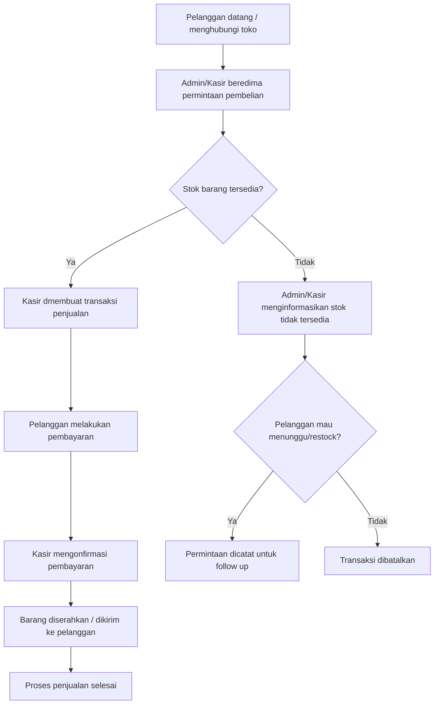

# Node 1 - Business Process Diagram

```mermaid
flowchart TD

    A[Pelanggan datang / menghubungi toko] --> B[Admin/Kasir beredima permintaan pembelian]
    B --> C{Stok barang tersedia?}
    C -- Ya --> D[Kasir dmembuat transaksi penjualan]
    D --> E[Pelanggan melakukan pembayaran]
    E --> F[Kasir mengonfirmasi pembayaran]
    F --> G[Barang diserahkan / dikirim ke pelanggan]
    G --> H[Proses penjualan selesai]

    C -- Tidak --> I[Admin/Kasir menginformasikan stok tidak tersedia]
    I --> J{Pelanggan mau menunggu/restock?}
    J -- Ya --> K[Permintaan dicatat untuk follow up]
    J -- Tidak --> L[Transaksi dibatalkan]
```
