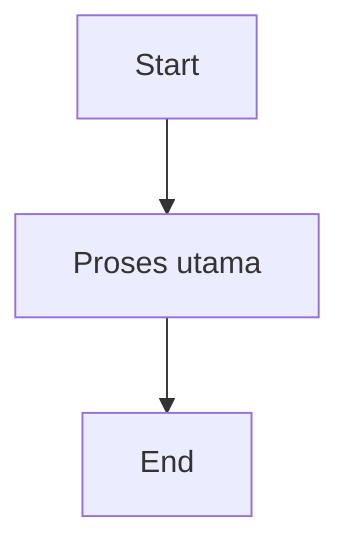
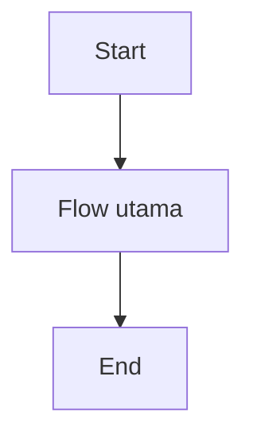
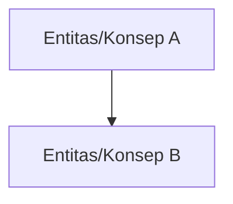

# PRD - [Nama Epic]

## Business Process Diagram

## Problem Statement Epic

[Isi problem statement epic]

## Goal Epic

[Isi goal epic]

## Indikator Keberhasilan Epic

| Kategori | Nama Indikator | Deskripsi | Cara Pengukuran | Waktu Pengukuran | Target | Penanggung Jawab |
| -------- | --------------  | --------- | --------------- | --------------- | ------ | ---------------- |
|          |                |           |                 |                  |        |                  |

## Peta Flow Awal

## Role Access Matrix

| Fitur        | Role 1 | Role 2 | Role 3 | Role 4 |
| ------------ | ------ | ------ | ------ | ------ |
| [Nama Fitur] | ✓      | ✓      | -      | -      |

## Scope

### In

* [Scope in]

### Planned

* [Planned scope / planned features]

### Out of Scope

* [Out of scope]

## Aturan Bisnis Epic

* [Aturan bisnis epic 1]
* [Aturan bisnis epic 2]

## Diagram Konsep

## Supporting Information

[Supporting information epic]

